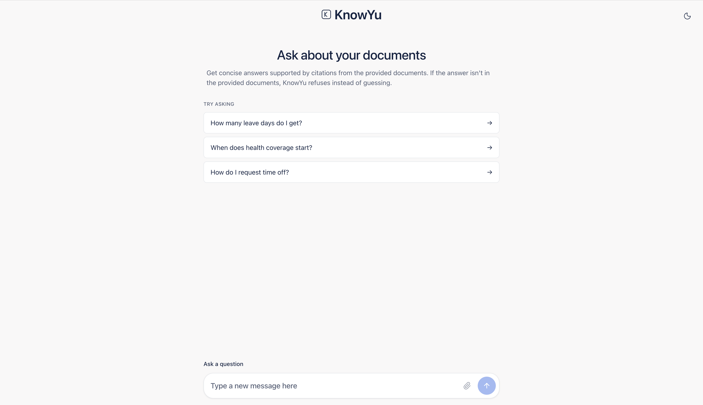
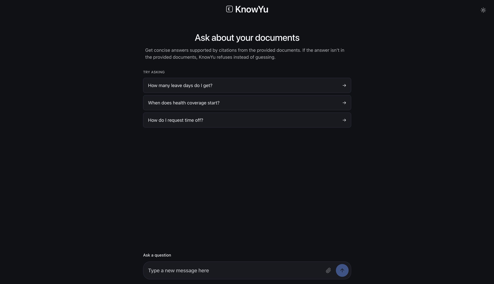

# KnowYu

A retrieval-augmented question-answering bot that answers questions from
your documents — with citations you can verify, and honest refusals when
the answer isn't in the corpus.

## The problem

Most RAG bots hallucinate. When they can't find an answer, they invent one.
KnowYu structurally cannot.

## What makes it different

Three gates prevent hallucination:

1. **Pre-LLM threshold** — if no chunk scores above 0.7 cosine similarity,
   the LLM is never called. The user gets "I don't know based on the
   provided documents."

2. **Prompt contract** — the system prompt forbids outside knowledge,
   wraps context in XML delimiters, and requires an exact refusal string.

3. **Post-LLM citation verification** — every citation the model returns
   is checked against the retrieved chunks. Fabricated citations are
   stripped before the answer reaches the user.

The result: the bot can be wrong, but it cannot be confidently wrong.

## Preview

| Light | Dark |
|---|---|
|  |  |

Both themes are available via the toggle in the top-right corner. The
choice persists across reloads.

## Stack

| Layer | Technology |
|---|---|
| Framework | Next.js 15 (App Router, React 18) |
| Database | Supabase Postgres + pgvector (HNSW index, cosine distance) |
| LLM | OpenAI GPT-4o-mini |
| Embeddings | OpenAI text-embedding-3-small (1536 dimensions) |
| Rate limiting | Upstash Redis (serverless-safe) |
| Hosting | Vercel-ready |
| Testing | Vitest (20 unit tests) |
| Icons | Lucide React |

## Documentation

Eleven planning documents in docs/:

- PRD — product requirements, success metrics
- TRD — technical requirements, data model
- System Design — architecture, tradeoffs, failure modes
- Security — threat model, prompt injection defense
- API Design — versioning, error codes, streaming format
- Backend Rules — coding standards
- Frontend Rules — component standards
- Design Rules — colors, typography, universal device support
- Database Rules — schema, RLS, indexes
- Testing Rules — test pyramid, CI config
- Upload Security — v2 upload threat model and mitigations

## Running locally

Prerequisites: Node.js 20+, Docker, an OpenAI API key with credits, and a
free Upstash Redis database.

    git clone https://github.com/RISHI9922/KnowYu
    cd KnowYu
    npm install
    cp .env.example .env.local

Edit .env.local with your values:

| Variable | Where to get it |
|---|---|
| NEXT_PUBLIC_SUPABASE_URL | Supabase dashboard |
| NEXT_PUBLIC_SUPABASE_ANON_KEY | Same dashboard |
| SUPABASE_SERVICE_ROLE_KEY | Same dashboard, server-only |
| OPENAI_API_KEY | platform.openai.com/api-keys |
| INGEST_ADMIN_TOKEN | openssl rand -base64 32 |
| UPSTASH_REDIS_URL | console.upstash.com free tier |
| UPSTASH_REDIS_TOKEN | Same |
| ALLOWED_ORIGINS | http://localhost:3000 for local dev |

Start Supabase locally:

    npx supabase start
    npx supabase db reset

Run the app:

    npm run dev

Open http://localhost:3000.

Ingest a document: place PDF or Markdown files in ./corpus/, then:

    source .env.local
    curl -X POST http://localhost:3000/api/v1/ingest \
      -H "Authorization: Bearer $INGEST_ADMIN_TOKEN" \
      -H "Idempotency-Key: $(uuidgen)" \
      -H "Content-Type: application/json" \
      -d '{}'

## Deploying

Before deploying publicly, add Vercel Password Protection to prevent
unknown users from consuming your OpenAI credits:

1. Push the repo to GitHub.
2. Import the repo at https://vercel.com/new.
3. Set the 8 environment variables from `.env.example`.
4. Deploy.
5. Project Settings → Deployment Protection → enable Password Protection.
6. Share the password only with people you trust.

Once usage stabilizes, you can remove the password. See
[docs/SECURITY.md](docs/SECURITY.md) for the full threat model.

## Cost discipline

Every query is capped at 5 chunks, 2,400 total tokens, 500 output tokens,
and approximately $0.005 per query. Most RAG bots spend 4x more per query.

## Design

The interface is intentionally calm. No gradients, no purple AI colors, no
glassmorphism, no shaders. The reference set is Stripe Docs, Linear, and
Vercel.

Light and dark modes are both supported, respecting the operating system
preference by default and persisting an explicit choice in localStorage.

## Testing

    npm test

20 unit tests cover chunking, prompt construction, and retrieval.

## What's not in v1

- Admin browser upload UI (spec in docs/UPLOAD_SECURITY.md)
- User accounts (single-tenant by design)
- Conversation history persistence (state-only)

## License

MIT
